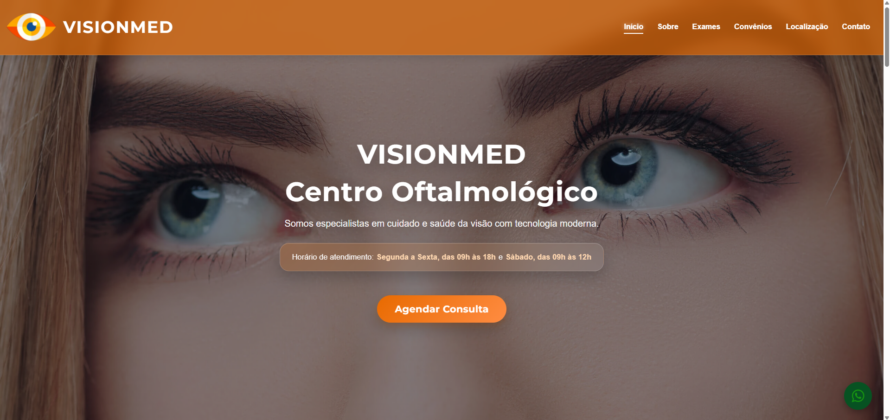
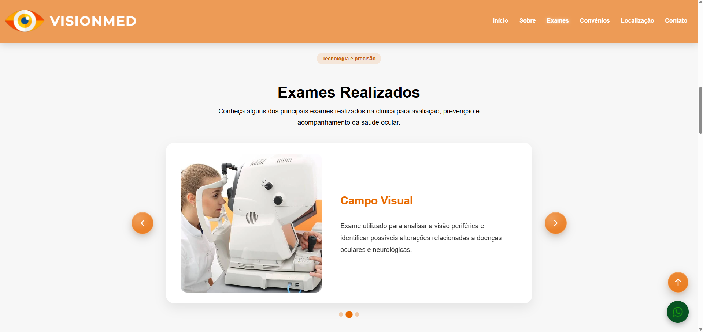
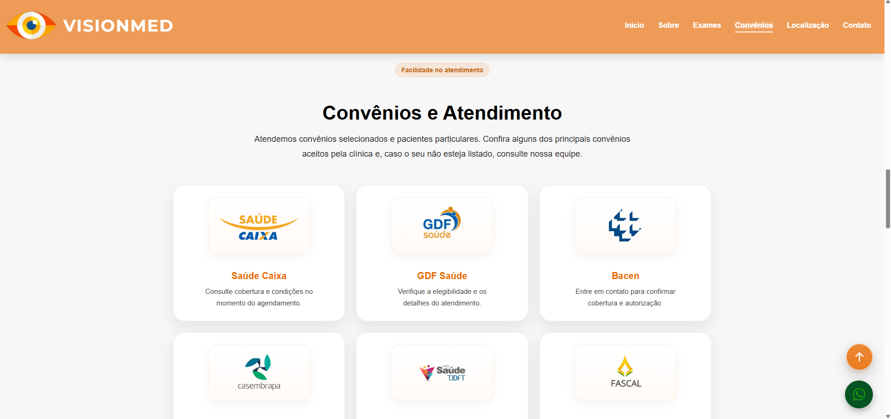
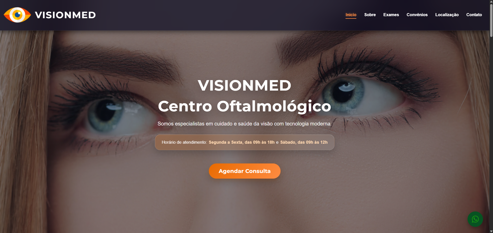
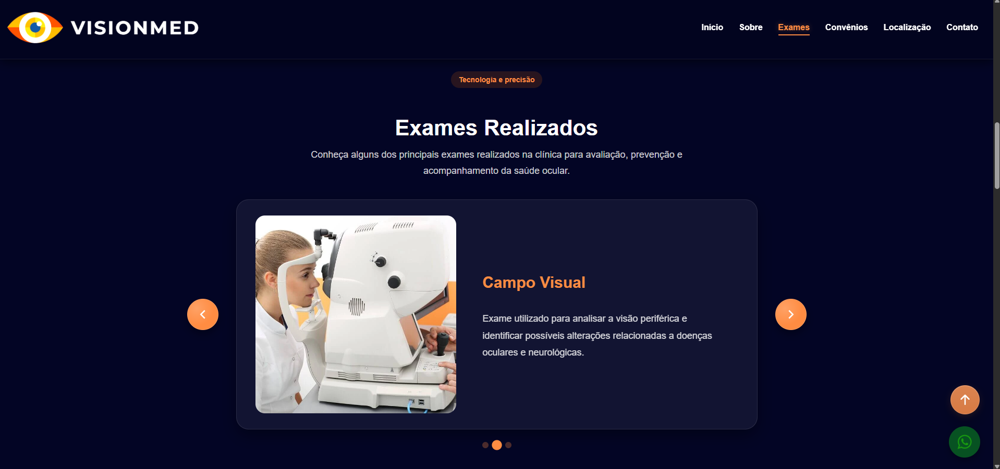
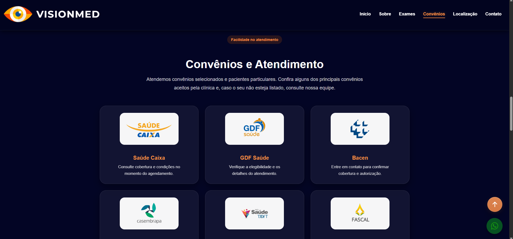

## VisionMed – Centro Oftalmológico

Landing page institucional desenvolvida para a VisionMed, com foco em experiência do usuário (UX), identidade visual profissional e acessibilidade.
O projeto prioriza navegação intuitiva, comunicação clara e facilitação do contato entre paciente e clínica.

Construído com HTML, CSS e JavaScript puro, o site incorpora recursos modernos como dark mode automático, carrossel interativo customizado e layout totalmente responsivo.

<h2 align="center">📸 Preview do Projeto</h2>

<h3>🌞 Modo Claro</h3>

  

  

  

---

<h3>🌙 Modo Escuro</h3>

  

  

  

## 📌 Sobre o Projeto

* A proposta do site é estabelecer a presença digital da clínica, facilitando o acesso de pacientes a informações essenciais como exames realizados, convênios aceitos e canais diretos de agendamento.

* Além de transmitir credibilidade, o projeto busca simplificar a jornada do usuário até o contato final, com foco em clareza, organização e experiência.

## 🚀 Diferenciais do Projeto

- Visual limpo e institucional
- Paleta de cores alinhada à identidade da clínica
- Navegação simples e intuitiva
- Adaptação automática ao tema do sistema operacional
- Integração com WhatsApp e Google Maps
- Layout responsivo completo
- Interface refinada com foco em experiência do usuário (UX)
- Seção de contato em estilo premium com foco em conversão

## ⚙️ Destaques Técnicos

- Carrossel infinito customizado com suporte a swipe (touch + mouse)
- Detecção automática de tema via prefers-color-scheme
- Header inteligente com comportamento dinâmico no scroll
- Destaque automático do item ativo no menu conforme a seção visível
- Estrutura baseada em HTML semântico e boas práticas de acessibilidade
- Microinterações e animações suaves para melhor experiência visual

## ♿ Acessibilidade

* O site foi desenvolvido com atenção à acessibilidade e usabilidade, buscando oferecer uma experiência inclusiva para diferentes perfis de usuários, especialmente    considerando o contexto da saúde visual.

* Boas práticas aplicadas:
*Uso de HTML semântico*
*Textos alternativos em imagens*
*Navegação clara e previsível*
*Elementos com bom tamanho para interação (desktop e mobile)*
*Estrutura compatível com leitores de tela*

## 🛠 Tecnologias Utilizadas
- *HTML5* → Estrutura semântica e acessível
- *CSS3* → Layout responsivo, animações e design system customizado
- *JavaScript (Vanilla)* → Manipulação de DOM e lógica de interação
- *Google Maps Embed API* → Integração de localização
- *WhatsApp API* → Canal direto de conversão
- *Google Fonts* → Tipografia moderna (Montserrat)

## ⚡ Funcionalidades

- Navegação dinâmica com scroll suave
- Destaque automático do item ativo no menu
- Alternância automática de tema (claro/escuro)
- Carrossel interativo com suporte a toque
- Botão flutuante de WhatsApp
- Botão de retorno ao topo
- Animações de entrada nas seções
- Integração com mapa e redes sociais

## 📂 Estrutura do Projeto

VisionMed/
├── visionmed.html   *Documento principal*
├── home.css         *Estilização e design system*
├── script.js        *Lógica de interações*
└── imagens/         *Assets visuais*

## 🧩 Seções do Site

- Início → Banner principal com CTA para agendamento
- Sobre → Apresentação institucional da clínica
- Exames → Carrossel com principais procedimentos
- Convênios → Planos atendidos e orientações
- Localização → Endereço com mapa integrado
- Contato → Canais diretos com destaque para WhatsApp
- Footer → Informações institucionais e navegação rápida

## 🎨 Identidade Visual

* O design foi baseado em uma paleta que transmite confiança e modernidade:

- *Azul Marinho* → Seriedade e estabilidade
- *Laranja* → Destaque para ações e conversão
- *Tons neutros* → Leveza e legibilidade

## ▶️ Como Executar o Projeto

* Este é um projeto front-end estático, não sendo necessário instalar dependências:

- Faça o download ou clone o repositório
- Abra o arquivo visionmed.html em qualquer navegador

⚠️ O uso deste código é restrito e não é permitido para reutilização, modificação ou distribuição sem autorização do autor.

## 📱 Responsividade

* O site foi desenvolvido com abordagem responsiva desde a base, garantindo adaptação consistente entre:

*smartphones*
*tablets*
*notebooks*
*desktops*

* Foram aplicados ajustes como:

- reorganização do header e menu
- redimensionamento de textos e botões
- adaptação do carrossel para touch
- reorganização de grids e cards
- adequação do footer
- reposicionamento de elementos interativos

* A responsividade continua sendo refinada como parte da evolução contínua do projeto.

## 🧠 Desafios no Desenvolvimento

* Durante a construção do projeto, alguns desafios contribuíram diretamente para sua evolução:

1. Identidade visual coerente
- Definir uma estética que transmitisse profissionalismo, confiança e acolhimento.

2. Organização do layout
- Transformar uma estrutura linear em uma interface mais fluida e equilibrada.

3. Ajustes finos de UI
- Alinhamento de elementos, espaçamentos, header, footer e navegação.

4. Implementação do modo escuro
- Adaptação completa de cores, contraste e legibilidade.

5. Navegação e comportamento do header
- Correção de âncoras e destaque dinâmico no menu.

6. Carrossel interativo
- Desenvolvimento de lógica com:
 *navegação*
 *indicadores*
 *autoplay*
 *suporte a swipe*

7. Responsividade
- Adaptação completa da interface para dispositivos móveis.

8. Equilíbrio entre estética e funcionalidade
- Ajustes constantes para manter usabilidade sem perder qualidade visual.

9. Evolução contínua
- Refinamentos progressivos em layout, animações e experiência.

## 🔮 Possíveis Melhorias Futuras

- Formulário de agendamento interno
- Painel administrativo
- Otimização de SEO
- Galeria da clínica
- Integração com backend

## 📌 Status do Projeto

 Em desenvolvimento. 
 O projeto possui base sólida e funcional, com melhorias contínuas planejadas.

## 👨‍💻 Autor

*Guilherme Pinheiro Rodrigues de Souza*

## 📄 Licença

* Este projeto é de propriedade exclusiva do autor.
* Todos os direitos estão reservados. 

*Não é permitido copiar, modificar, distribuir ou utilizar este código, total ou parcialmente, sem autorização prévia.*

* Este repositório tem finalidade exclusivamente demonstrativa (portfólio).